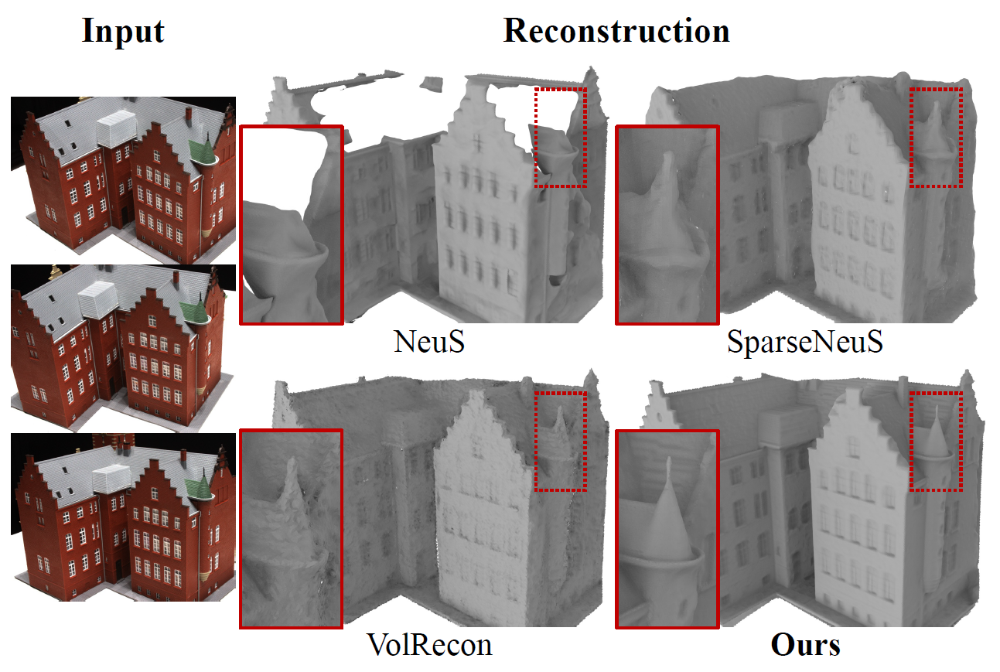
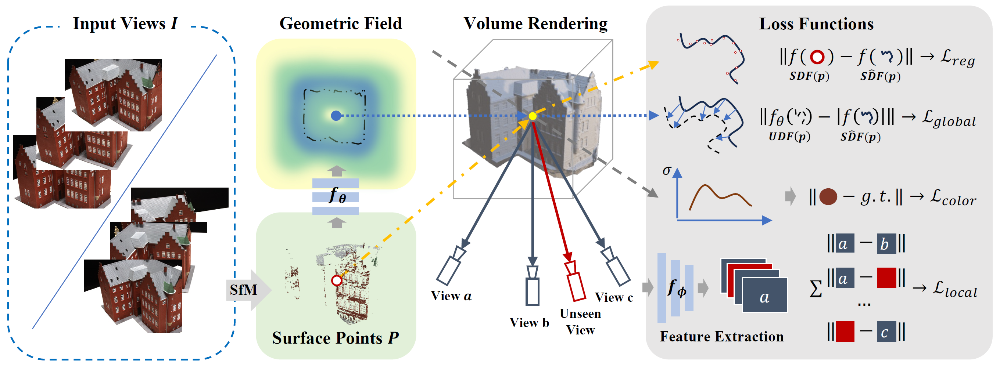

# NeuSurf [AAAI'24]
Implementation of *NeuSurf: On-Surface Priors for Neural Surface Reconstruction from Sparse Input Views*

### [Project Page](https://alvin528.github.io/NeuSurf/) | [Paper](https://arxiv.org/abs/2312.13977) | [Data](https://drive.google.com/drive/folders/18AZw4zi3fNQ-NKttNeVBp9cTja8NBnSA?usp=drive_link)

<div align=center>   </div>

### TODO

- [ ] Mesh results release

## Overview

<div align=center>   </div>

## Installation

Our code is implemented in Python 3.10, PyTorch 2.0.0 and CUDA 11.7.
- Install Python dependencies
```
conda create -n neusurf python=3.10
conda activate neusurf
pip install torch==2.0.0 torchvision==0.15.1
pip install -r requirements.txt
```
- Compile C++ extensions
```
cd extensions/chamfer_dist
python setup.py install
```

## Dataset

Data structure:

```
data
|-- DTU_pixelnerf
    |-- <case_name, e.g. dtu_scan24>
        |-- cameras_sphere.npz
        |-- pcd
            |-- <case_name>.ply
        |-- cam4feat
            |-- pair.txt
            |-- cam_00000000_flow3.txt
            |-- cam_00000001_flow3.txt
            ...
        |-- image
            |-- 000000.png
            |-- 000001.png
            ...
        |-- mask
            |-- 000.png
            |-- 001.png
            ...
|-- DTU_sparseneus
|-- blendedmvs_sparse
```

You can directly download the processed data [here](https://drive.google.com/drive/folders/18AZw4zi3fNQ-NKttNeVBp9cTja8NBnSA?usp=drive_link).

## Running

- Training

```
CUDA_VISIBLE_DEVICES=0
python exp_runner.py --mode train --conf ./confs/dtu.conf --case <case_name, e.g. dtu_scan24>
```

- Extract mesh

```
CUDA_VISIBLE_DEVICES=0
python exp_runner.py --mode validate_mesh --conf ./confs/dtu.conf --case <case_name> --is_continue
```

<!-- ## Use Your Own Data -->

## Citation

If you find our work useful in your research, please consider citing:

```
@inproceedings{huang2024neusurf,
  title={NeuSurf: On-Surface Priors for Neural Surface Reconstruction from Sparse Input Views},
  author={Huang, Han and Wu, Yulun and Zhou, Junsheng and Gao, Ge and Gu, Ming and Liu, Yu-Shen},
  booktitle={Proceedings of the AAAI Conference on Artificial Intelligence},
  volume={38},
  number={3},
  pages={2312--2320},
  year={2024}
}
```

## Acknowledgement

This implementation is based on [CAP-UDF](https://github.com/junshengzhou/CAP-UDF/), [D-NeuS](https://github.com/fraunhoferhhi/D-NeuS) and [Vis-MVSNet](https://github.com/jzhangbs/Vis-MVSNet). Thanks for these great works.
